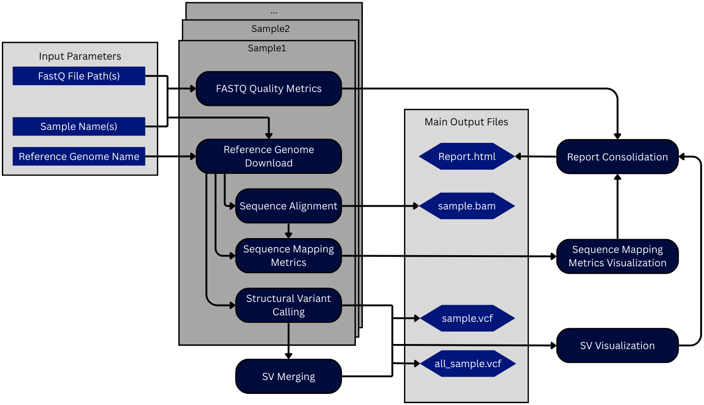
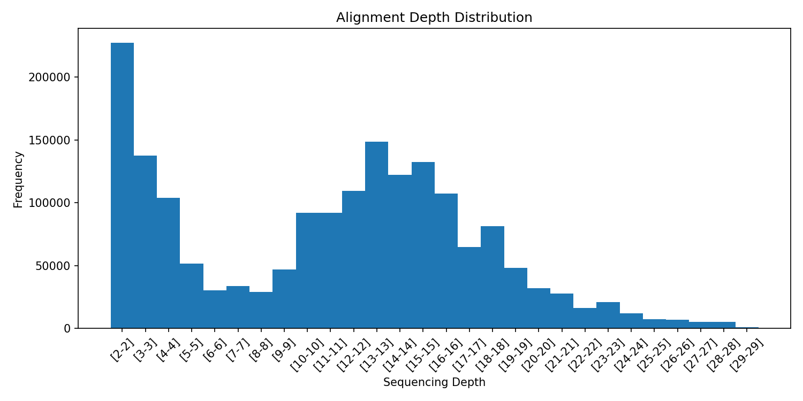
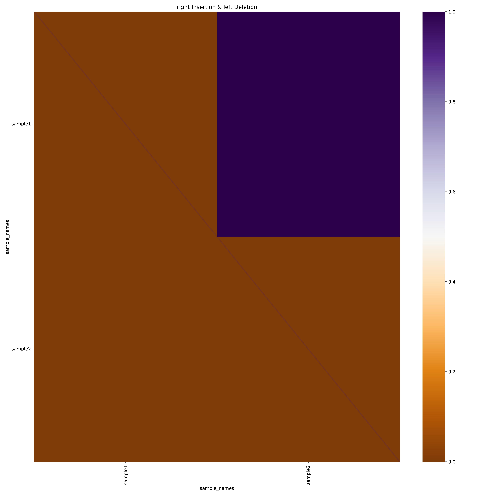
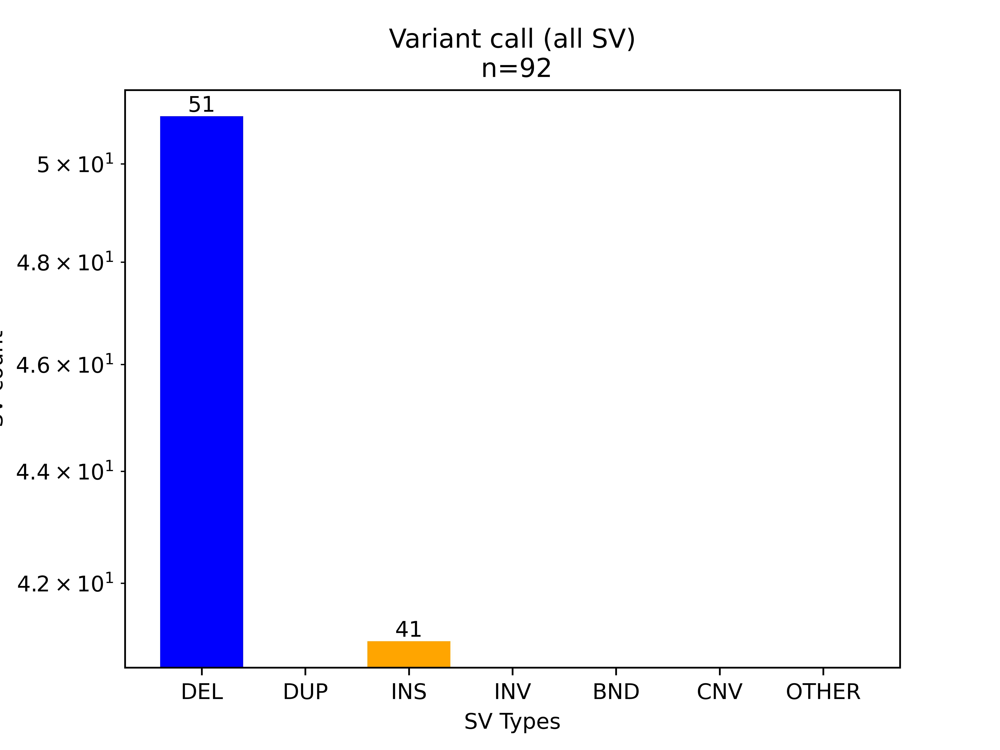

# Long-read Whole Genome Sequencing Pipeline for Structural Variant Detection and Comparison
### *Constructed by David Lin*
A pipeline for long-read Oxford Nanopore Technologies whole genome sequencing data with comparative visualizations of structural variants
## Introduction

### Background

Long-read whole-genome sequencing (WGS) generated by Oxford Nanopore Technologies (ONT) produces reads that can span complex genomic regions, making them especially valuable for identifying structural variants (SVs) in cancer genomes.<sup>1</sup> To support reproducible analysis and facilitate interrogation of ONT datasets, a structured workflow is required to process raw FASTQ files, evaluate sequencing quality, align reads to a reference genome, call SVs, and consolidate results into an interpretable format. The dataset selected for demonstration includes subsampled ONT-WGS data from the SiHa cervical cancer cell line, a well-characterized model containing known chromosomal rearrangements, integrated HPV sequences, and tumour-associated SVs.<sup>2</sup>

### Purpose

The goal of this workflow is to create a straightforward, expandable pipeline that enables users to analyze ONT-WGS data and evaluate structural variation in cancer samples. The workflow is intended to be generalizable so users can replace the example dataset with an arbitrary number of samples to perform a similar comparative analysis.

### Rationale

A dedicated workflow for ONT-WGS structural variant analysis is urgently needed because long-read cancer genomics remains technically complex, resource-intensive, and highly variable across samples. Without a standardized pipeline, differences in quality control procedures, alignment parameters, and SV calling strategies can lead to inconsistent results that are difficult to compare or reproduce. This workflow addresses that gap by providing a clear, validated, and fully automated process that enables any user without specialized bioinformatics expertise to analyze ONT-WGS datasets and interpret meaningful SV insights.

This project is also helpful for my present project on osteosarcoma, a pediatric bone cancer, which contains profound SVs and not well-studied telomere structural alterations.<sup>3</sup> This pipeline will serve as the initial data exploration tool, testing if current SV detection tools can address telomeric SVs that were not mappable before long-read sequencing was available.

## Usage

### Installation

This pipeline requires `Conda`/`Miniconda`, `Git`, and `Nextflow`.

[`Conda`](https://docs.conda.io/projects/conda/en/stable/user-guide/install/index.html)/[`Miniconda`](https://www.anaconda.com/docs/getting-started/miniconda/install) is needed to run all the dependencies of this workflow. `Miniconda` is adequate for this pipeline. (`Conda` version 25.9.1 was used in testing, but the latest version should work.)

After you have set up `Conda` on your device, please install `Git` and `Nextflow` in your environment.

- [`Git`](https://git-scm.com/install) is for version control. Stay up to date with the latest release! (`Git` version 2.51.0 was used in testing, but the latest version should work.)

- [`Nextflow`](https://www.nextflow.io/docs/latest/install.html#conda) is needed to run the pipeline.  (`Nextflow` version 25.10.1 was used in testing.)

*Skip the documentation, just give me the command:*

```
conda install anaconda::git bioconda::nextflow
```

After installations, clone this repository:

```         
git clone https://github.com/davidlin5922/ontwgs_pipeline.git
```

### Dependencies

*The pipeline will automatically download and use all packages when running, so you **don't need** to manually download them.*

`<channel>::<package name>==<version>`
``` 
anaconda::matplotlib==3.10.6
anaconda::python=3.12
anaconda::pandas==2.3.3
bioconda::minimap2==2.30
bioconda::nanoplot==1.46.1
bioconda::samtools==1.22.1
bioconda::sniffles==2.7.1
conda-forge::r-base==4.5.2
conda-forge::r-rmarkdown==2.30
hcc::sniffles2-plot==0.2.1
```

### Inputs and Outputs

Directory Structure:

```
└── ontwgs_pipeline/
    ├── config/
    │   ├── fastq_paths
    │   └── sample_names
    ├── example/
    │   ├── sample_report.html
    │   ├── SiHa-ONT_1000_1.fq
    │   └── SiHa-ONT_1000_2.fq
    ├── results/
    │   └── ...
    ├── scripts/
    │   ├── plot_bamqc.py
    │   └── report.rmd
    ├── work/
    │   └── .../
    ├── main.nf
    ├── nextflow.config
    └── params.yaml
```

#### Parameters

This pipeline has three **mandatory** parameters: `sample_names`, `fastq_paths`, and `reference_genome`. They are set in `params.yaml` by default:

```
sample_names: ./config/sample_names
FASTQ_paths: ./config/FASTQ_paths
reference_genome: <hg19|hg38|CHM13>
```

You need to put in unique sample names (no whitespace) in `config/sample_names` and their corresponding FASTQ file paths in `config/FASTQ_paths`, one per line.

You must also put in the reference genome you want to use in `params.yaml`. The currently available ones are `hg19`/`GRCh37`, `hg38`/`GRCh38`, `CHM13`/`T2T`/`t2t`.

#### Running the Pipeline

After you clone the repository to your device and set your parameters, you can start running the pipeline.

```         
nextflow run main.nf -params-file params.yaml
```

It will take about 10 minutes for the first example run to set up all the conda environments.

#### Outputs

The output files will be generated in `results/`:

```
└── ontwgs_pipeline/
    ├── .../
    └── results/
        └── bamqc/
            └── <sample_name>/
        └── bams/
            └── sample_name.bam
            └── sample_name.bam.bai
        └── qc/
            └── <sample_name>/
        └── sniffles2/
            └── all/
            └── <sample_name>/
        └── report.html
```

`bamqc`, `qc`, and `sniffles2` all contain folders, named by the `sample_names` you passed in `fastq_paths`, in which the tables and figures in `report.html` originated. `bams` contains all the aligned, sorted, and indexed BAM files for you. `sniffles2` also contains the individual and merged variant call format (VCF) files.

If some files are missing in `results`, try:

```
nextflow run main.nf -params-file params.yaml -resume
```

### Pipeline Overview



**1.  Quality Control**

`nanoplot` is used to assess the quality of your raw ONT reads, including read-length and read-quality distributions, N50, and yield. Plots and a summary table are generated for each sample to provide an overview before downstream processing. The summary table of all samples is also consolidated in the `All` tab (if more than one sample is present).

**2.  Alignment**

Reads are aligned to the reference genome of your choice using `minimap2` and optimized for ONT long-read data. Resulting BAM files are sorted, indexed, and passed through `samtools stats` to quantify alignment quality, mapping metrics, and read-length characteristics. A customized Python script `script/plot_bamqc.py` is used to generate the mapping quality distribution and sequencing depth computed.

**3.  Structural Variant Calling**

SVs are called using `Sniffles2`, which was designed for long-read data. The pipeline produces per-sample VCF files, SNF files for multi-sample merging, and a combined VCF of all samples in the run, which will be used for multi-sample comparison.  Visualizations of the VCF files are built with `sniffles2-plot`.

**4.  Result Visualization**

All figures, tables, and summary metrics are consolidated into a single `report.html` generated via `RMarkdown`.
The report includes QC plots and metrics, alignment and mapping statistics, read-length and coverage summaries, SV distributions and comparisons across samples, and cohort-level visualizations.

## Sample Run and Expected Results

This pipeline was created to compare the structural variants present in cancer samples from FASTQ files to a fully visualized report. Unfortunately, ONT WGS sequencing data is always very large and takes a long time to run, let alone multiple full datasets.

A small toy dataset is included in `example/`. It contains two FASTQ files, each with 1,000 ONT reads derived from the SiHa cell line, originally isolated from fragments of a primary uterine tissue biopsy from a 55-year-old Japanese female patient with squamous cell carcinoma.<sup>4</sup> Because the dataset is small, it is suitable for testing whether the pipeline installs and executes correctly. An example completed report (generated using the **CHM13/T2T reference genome**) `example/sample_report.html` can be used as a reference to ensure your pipeline run produced the expected output. 

The toy dataset is a highly reduced subsample, so SV detection sensitivity will be low, resulting in limited or absent calls in some regions. What can be reliably expected is that the two toy samples will show minimal structural variants; events such as indels (insertions and deletions) may be present, whereas duplications and inversions are rarer, even in full datasets.

### FastQC: N50

N50 is the read length such that 50% of the total assembled genome length is contained in reads of this length or longer.

### FestQC: Yield


This plot shows you how much sequencing yield (total number of bases) you have if you only include reads above a given length threshold.

### MappingQC: Sequencing depth



This histogram shows the number of genomic positions covered at each sequencing depth, tells you how uniformly the reads align, whether you have appropriate coverage for variant calling, and how much of the genome is under- or over-covered.

### SV Compare: Heatmap



This plot shows you the deletion and insertion intersections between samples. Although our example data is minimal, it appears there is a single common indel between the two samples!

### SV Compare: Sample upset


This plot summarizes the number of SVs unique to each sample and the number shared between them. Here, it tells us that there are 48 SVs unique to sample1, 43 to sample2, and 1 (the one we saw in the heatmap) shared between the two samples.

### SV Compare: SV site per genome


This plot compares the number of deletions (del) and insertions (ins) detected across the samples.

### SV Compare: Variant count



This plot adds up all SVs detected across the samples. We can see that the number agrees with the upset plot.

**These results look like what we expected. :D**

## References
1. Moustakli E, Christopoulos P, Potiris A, Zikopoulos A, Mavrogianni D, Karampas G, et al. Long-Read Sequencing and Structural Variant Detection: Unlocking the Hidden Genome in Rare Genetic Disorders. Diagnostics. 2025 July 17;15(14):1803. 
2. Adeel MM, Jiang H, Arega Y, Cao K, Lin D, Cao C, et al. Structural Variations of the 3D Genome Architecture in Cervical Cancer Development. Front Cell Dev Biol. 2021 July 23;9:706375. 
3. Rajan S, Zaccaria S, Cannon MV, Cam M, Gross AC, Raphael BJ, et al. Structurally Complex Osteosarcoma Genomes Exhibit Limited Heterogeneity within Individual Tumors and across Evolutionary Time. Cancer Research Communications. 2023 Apr 12;3(4):564–75. 
4. [Internet]. American Type Culture Collection; [cited 2025 Nov 25]. Available from: https://www.atcc.org/products/htb-35 
